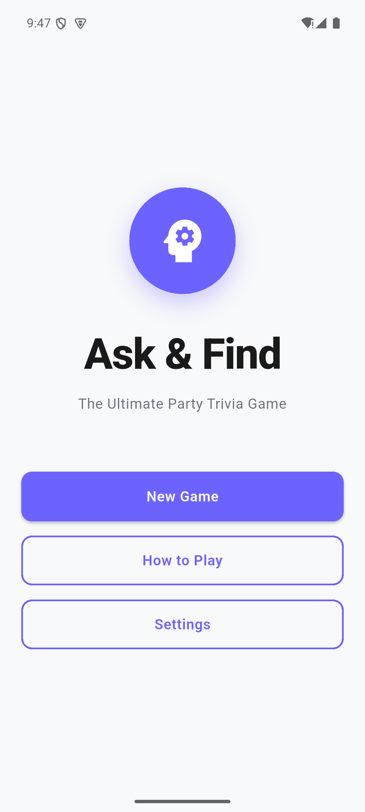
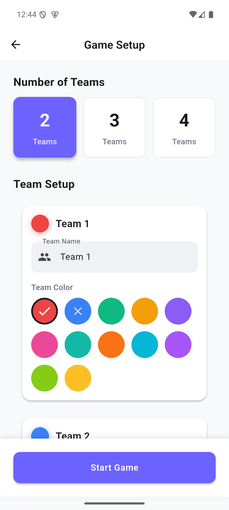
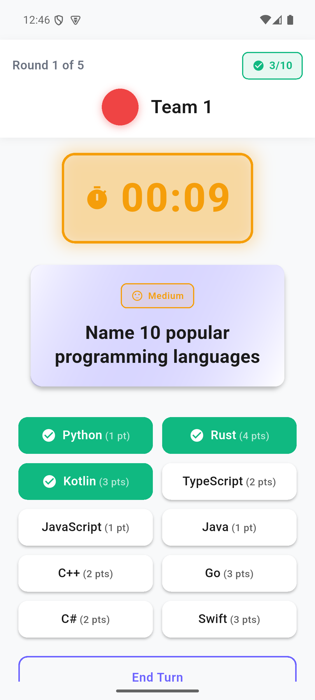

# Ask & Find

[](https://github.com/mgialousis/ask-and-find/actions/workflows/flutter-ci.yml)

A bilingual, local-multiplayer party game for Android and iOS. Two to four
teams race the clock to uncover items from hidden trivia lists, with each
answer weighted by difficulty.

This project demonstrates production-oriented Flutter work: Riverpod state
management, deterministic game flows, responsive layouts, localization,
offline-first community submissions, configurable analytics, and automated tests.

## Preview

Real Android app captures with demonstration teams and bundled trivia.

<p>
  
  
  
</p>

[Two-minute product walkthrough](docs/WALKTHROUGH.md)

## 🎮 What is Ask & Find?

Ask & Find is an English version inspired by the Greek game "Πες Βρες!" where 2-4 teams take turns guessing answers from category-based prompts. Think of it as a party game mashup of trivia and speed thinking!

**Example Prompt:** "Name countries in Europe"
- 10 hidden answers to discover
- 60 seconds on the clock
- Tap to reveal each answer
- Score points for each correct guess

## 🚀 Current Status

The core game is playable end to end on Android and iOS:

- Complete setup → game → results → play-again flow
- Configurable teams, rounds, timer, and difficulty
- Riverpod-managed game, setup, timer, settings, and submission state
- 317 bilingual English/Spanish trivia cards with per-answer scoring
- Sound effects, haptic feedback, sharing, and persistent settings
- New-card and correction submissions with offline retry support
- PostHog analytics with a user-facing privacy toggle
- Ask & Find branding and generated Android/iOS launcher icons

Run it locally with `flutter run`.

## 🎯 Features

- Home screen and routed game flow
- Team setup for 2-4 teams with custom names and colors
- Configurable rounds, timer duration, and difficulty
- Timer-based gameplay with countdown audio and haptics
- Per-answer scoring, score adjustment, team rotation, and final results
- Round-complete dialog that requires Continue or End Game
- English and Spanish localization
- Card submission and issue-reporting flows
- Offline submission queue backed by a credential-free HTTPS API client
- Responsive phone and tablet layouts

## 🏗️ Architecture

```
lib/
├── core/              # Analytics, config, routing, theme, and utilities
├── domain/entities/   # Game and submission entities
├── data/
│   ├── repositories/  # Cards and submission repositories
│   └── sources/       # Asset loading, HTTPS submission client, and offline storage
└── presentation/
    ├── state/         # Riverpod providers and notifiers
    ├── screens/       # Home, setup, game, results, settings, submissions
    └── widgets/       # Shared UI components
```

Trivia content is loaded from `assets/cards.json`; app and round state are managed with Riverpod.

Community submissions go to a separately deployed HTTPS service. This repository
contains the mobile client and [API contract](docs/SUBMISSION_API.md), not a
Google Sheets backend or privileged storage credentials.

## 🎲 How to Play

1. **Setup Teams**: Choose 2-4 teams, pick names and colors
2. **Configure Game**: Select rounds (5/7/10), timer (30/45/60/90s), difficulty
3. **Play Rounds**: Each team tries to find 10 answers before time runs out
4. **Score Points**: Earn the per-answer point value for each correct answer
5. **See Results**: Winner determined by highest score, ties detected

## 🛠️ Tech Stack

- **Framework:** Flutter
- **Language:** Dart ^3.10.4
- **State Management:** Riverpod
- **Navigation:** go_router ^12.0.0
- **Platforms:** Android, iOS

## 📦 Getting Started

### Prerequisites
- Flutter 3.38.8 (the version used by CI)
- Dart 3.10.4 or newer, provided by a compatible Flutter SDK

### Installation

```bash
# Clone the repository
git clone https://github.com/mgialousis/ask-and-find.git
cd ask-and-find

# Install dependencies
flutter pub get

# Run the app
flutter run

# Run tests
flutter test

# Check code quality
flutter analyze
```

Optional services are supplied as public compile-time configuration—never as
privileged credentials inside the app:

```bash
flutter run \
  --dart-define=SUBMISSIONS_ENDPOINT_URL=https://example.com/api/submissions \
  --dart-define=POSTHOG_API_KEY=your_public_project_key \
  --dart-define=POSTHOG_HOST=https://eu.i.posthog.com
```

Without a submission endpoint, contributions remain in the local retry queue.
See [the submission API contract](docs/SUBMISSION_API.md) for the backend
boundary and deployment security requirements.

### Quick Test Flow

```bash
flutter run
# 1. Tap "New Game"
# 2. Configure teams (try different numbers, names, colors)
# 3. Tap "Start Game"
# 4. Play through rounds
# 5. See winner on results screen
```

## 📁 Project Structure

See the directory overview above for the application architecture.

See `docs/RELEASE_GUIDE.md` for publishing/build steps.

See `docs/MOBILE_TESTING_GUIDE.md` for physical-device testing.

## 🎨 Design System

- **Theme:** Material Design 3
- **Colors:** 12 team colors + semantic colors (success, warning, error)
- **Typography:** Roboto with clear hierarchy
- **Responsive:** Phone (< 600dp) and Tablet (≥ 600dp) layouts
- **Components:** Custom widgets with consistent styling

## 🧪 Testing

```bash
# Run all tests
flutter test

# Run specific test
flutter test test/widget_test.dart

# Run with coverage
flutter test --coverage
```

**Current status:** 120 declared test cases across 11 test files, covering
localization, providers, setup, shared widgets, submissions, HTTP transport,
analytics settings, and app launch.

## 📊 Analytics (PostHog)

- Without a PostHog key, analytics are disabled. With a key configured,
  analytics are **enabled by default** unless the user has previously opted out.
  Users can disable them in Settings → Privacy → Analytics.
- Events use a persistent anonymous installation identifier and include app,
  device/platform, locale, and timezone metadata. This is telemetry, not a
  guarantee that no personal data is processed.
- Custom card content and team names are not captured.
- Configure the public PostHog project key with
  `--dart-define=POSTHOG_API_KEY=...`.
- Override the EU host with `--dart-define=POSTHOG_HOST=...` if needed.
- `POSTHOG_ALLOW_DEBUG=true` is intended only for non-release builds.

## Security and privacy

- Google or database administrator credentials are never embedded in the
  mobile application. Community submissions cross an HTTPS API boundary.
- The submission backend must validate payloads, rate-limit clients, restrict
  request sizes, and keep its storage credentials server-side.
- Analytics are disabled without configuration and can always be turned off by
  the user.
- Team names and custom card text are not included in analytics events.
- Pending submissions are stored locally until the configured API accepts them.

## 📝 Recent Changes

- Added 21 trivia cards and corrected accuracy issues in existing cards
- Rebranded the app and platform labels to Ask & Find
- Added a launcher-icon source and generated Android/iOS icon variants
- Added the Android build script's optional `--icons` generation step
- Prevented system back from dismissing the round-complete dialog

## 🤝 Contributing

This is a personal project. Feedback and suggestions are welcome!

## 🙏 Acknowledgments

- Inspired by the Greek game "Πες Βρες!"
- Built with Flutter and Material Design
- Developed with assistance from Claude Code

## License

Copyright (C) 2026 Miltiadis Gialousis.

This project's original code and content are licensed under the
[GNU Affero General Public License version 3 only](LICENSE)
(`AGPL-3.0-only`). You may use, modify, and redistribute them, including
commercially, under the license's terms. Distributed covered works must
provide corresponding source under those terms. If you modify the software
and let users interact with it remotely over a network, you must offer those
users the corresponding source of your modified version.

The software is provided without warranty. Third-party dependencies and any
separately licensed material retain their respective licenses and notices.
